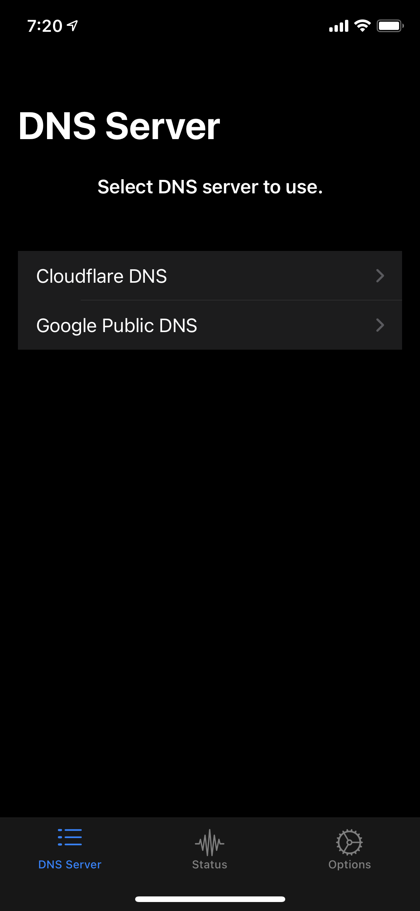
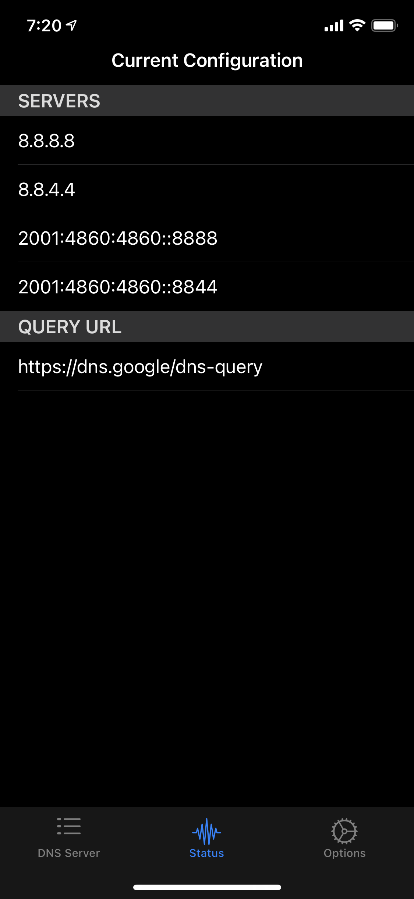
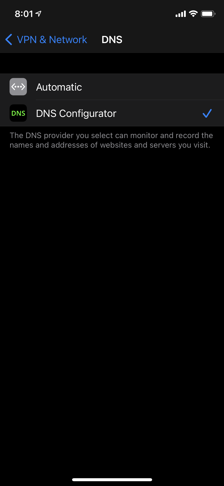

# DNS Configurator

## About

Simple DoH(DNS over HTTPS) configuration tool.

## Usage

1. Select a DNS service from a list.
1. Tap `Apply` button to update Network Extension.
1. Open Settings app in iOS.
1. Navigate to `General` -> `VPN & Network` -> `DNS`.
1. Select `DNS Configurator`.

## References

- [Enable encrypted DNS - WWDC 2020 - Videos - Apple Developer](https://developer.apple.com/videos/play/wwdc2020/10047/)

## Screen Shots

